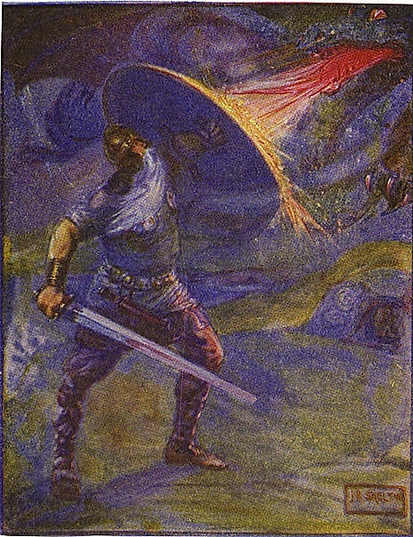

"beowulf" anticheat mod for minetest

Image source: https://en.wikipedia.org/wiki/Beowulf_(hero)

* State: **WIP**

# Features

* Kicks dragonfire clients if it detects a known version string
* Logs suspicious player movements
* Makes the `noclip` experience unpleasant

# Requirements

* Needs an engine debug-build or patch to expose the `version_string` in `minetest.get_player_information()`

# Settings

* **beowulf.dfdetect.enable_kick** if `true`: kicks the player if it detects a dragonfire version string, defaults to `false`
* **beowulf.noclip_hurt.enable** enables damage in common ground nodes to make the `noclip` experience as worse as possible (default: `false`)

# License

MIT